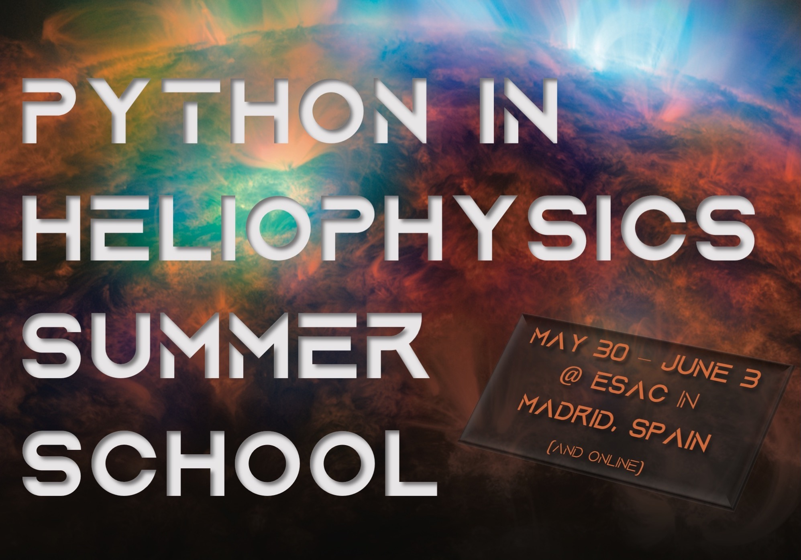

The Python in Heliophysics Community (PyHC) is excited to announce its inaugural 2022 Summer School, in partnership with the European Space Astronomy Centre (ESAC)! The PyHC Summer School will take place Monday, **30 May 2022 – Friday, 3 June 2022** at ESAC in beautiful Madrid, Spain. There will also be remote participation options for those unable to attend in-person. This event is free and open to all graduate students, early career scientists, and established scientists looking to transition to Python in the Heliophysics and Space Weather disciplines. PyHC Summer School attendees will learn Python best practices and receive hands-on instruction from experts as they take a deep dive — via tutorials, demos, and presentations — into the rich ecosystem of Heliophysics Python packages. 

 

### Preregistration
[Pre-register here](https://www.cosmos.esa.int/web/ihdea) today! 

 

### Dates
30 May 2022 – 3 June 2022

 

### Location
European Space Astronomy Centre (ESAC) 
Camino bajo del Castillo, s/n 
Urbanización Villafranca del Castillo 
Villanueva de la Cañada 
E-28692 Madrid, Spain 

(and online)

 

### Agenda
#### Day 1: Monday, 30 May 2022
**Focus: PyHC Introduction + AstroPy for Heliophysics + SunPy**
 - Introductions (welcome, agenda, code of conduct reminder, etc.) [15m]
 - Slide deck introducing PyHC [30m]
    - Includes overview of the group as a whole
    - Overview of PyHC resources (i.e. heliopython.org)
    - Overview of PyHC activities
    - Mention of our [standards](https://github.com/heliophysicsPy/standards/blob/main/standards.md), mission statement and strategic goals, and how they fit into doing open science! 
 - “AstroPy for Heliophysics” project introduction [2h45m; included 15m break halfway]
    - [https://github.com/astropy/astropy](https://github.com/astropy/astropy) 
    - [https://docs.astropy.org/en/stable/](https://docs.astropy.org/en/stable/) 
 - Lunch break [45m]
 - SunPy project introduction [2h45m; included 15m break halfway]
    - [https://github.com/sunpy/sunpy](https://github.com/sunpy/sunpy )
    - [https://docs.sunpy.org/en/stable/](https://docs.sunpy.org/en/stable/) 

#### Day 2: Tuesday, 31 May 2022
**Focus: PlasmaPy + SpacePy**
 - Kicking off the day’s activities [15m]
 - PlasmaPy project introduction [2h45m; included 15m break halfway]
    - [https://github.com/PlasmaPy/plasmapy](https://github.com/PlasmaPy/plasmapy) 
    - [https://docs.plasmapy.org/en/stable/](https://docs.plasmapy.org/en/stable/)
 - Lunch break [45m]
 - SpacePy project introduction [2h45m; included 15m break halfway]
    - [https://github.com/spacepy/spacepy](https://github.com/spacepy/spacepy)
    - [https://spacepy.github.io/](https://spacepy.github.io/) 

#### Day 3: Wednesday, 01 June 2022
**Focus: HAPI + Python Testing + Group Outing**
 - Kicking off the day’s activities [15m]
 - HAPI project introduction [3h15m; included 15m break halfway]
    - An intro for software-centric scientists who want to use HAPI data in their analyses 
    - A session for science-minded developers who want to serve HAPI data or incorporate it into their analyses
        - [https://github.com/hapi-server/client-python](https://github.com/hapi-server/client-python)
        - [http://hapi-server.org](http://hapi-server.org)
 - Python learning session: Testing [30m]
    - Intro to testing in Python and best practices for testing
        - Comprised of a pytest tutorial combined with a discussion on best practices for testing scientific software
 - End the day earlier
    - Transition to free time and/or planned activity
        - Trip to ESA/NASA deep space network station? (~30m from meeting site)
        - Hiking?
 - _Group Dinner this night!_

#### Day 4: Thursday, 02 June 2022
**Focus: pySPEDAS + pysat**
 - Kicking off the day’s activities [15m]
 - pySPEDAS project introduction [2h45m; included 15m break halfway]
    - [https://github.com/spedas/pyspedas](https://github.com/spedas/pyspedas) 
    - [https://pyspedas.readthedocs.io/en/latest/](https://pyspedas.readthedocs.io/en/latest/) 
 - Lunch break [45m]
 - pysat project introduction [2h45m; included 15m break halfway]
    - [https://github.com/pysat/pysat](https://github.com/pysat/pysat)
    - [https://pysat.readthedocs.io/en/latest/](https://pysat.readthedocs.io/en/latest/)

#### Day 5: Friday, 03 June 2022
**Focus: Kamodo + Speasy + Configuring PyHC Software Locally + Wrap Up**
 - Kicking off the day’s activities [15m]
 - Kamodo project introduction [2h45m; included 15m break halfway]
    - [https://github.com/nasa/Kamodo](https://github.com/nasa/Kamodo)
    - [https://ccmc.gsfc.nasa.gov/Kamodo/](https://ccmc.gsfc.nasa.gov/Kamodo/ ) 
 - Speasy (formally AmdaPy) project introduction [1h45m; included 15m break at end of session]
    - [https://pypi.org/project/speasy/](https://pypi.org/project/speasy/), [https://github.com/SciQLop/speasy](https://github.com/SciQLop/speasy) 
    - [https://speasy.readthedocs.io/en/stable/](https://speasy.readthedocs.io/en/stable/ )
 - Python learning session: Configuring and using PyHC packages locally [1h45m]
    - Installing how to’s, basic commands, etc.
 - Wrap up [30m]
    - Retrospective
    - Gather feedback from attendees — what did you like? Not like? What needed more/less time? What other topics do you hope to see in future summer schools? 
    - How did having it in Spain and/or online work?

 

### Additional Info
Please email either: 
 - <a href="mailto:Julie.Barnum@lasp.colorado.edu">Julie.Barnum@lasp.colorado.edu</a> 
 - <a href="mailto:Shawn.Polson@lasp.colorado.edu">Shawn.Polson@lasp.colorado.edu</a>