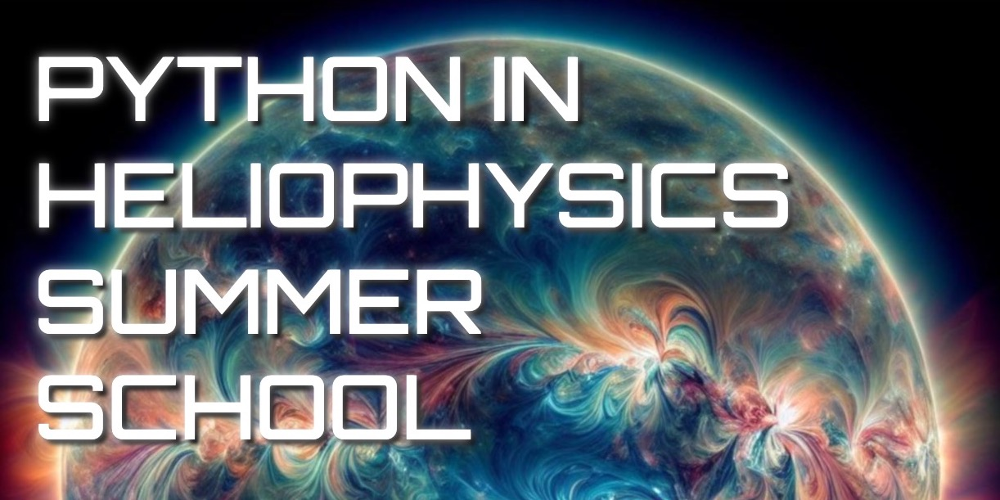

The Python in Heliophysics Community (PyHC) is excited to announce its 2024 Summer School, set to take place **Monday, May 20th to Friday, May 24th** at the prestigious [Laboratory for Atmospheric and Space Physics (LASP)](https://goo.gl/maps/mMapAsmgsg7DCrfZ7) in scenic Boulder, Colorado, USA. 

This year's Summer School builds on the foundational success of its predecessor, offering an even deeper dive into the rich ecosystem of Heliophysics Python packages. Open to graduate students, early career scientists, and anyone eager to deepen their understanding of Python in the Heliophysics and Space Weather disciplines, this program promises a mix of in-depth tutorials, engaging demos, and hands-on sessions, delivered by some of the field's leading experts.

Remote options will be available for those unable to make the trip to Boulder. Further, in keeping with PyHC’s commitment to knowledge-sharing, **this year's event remains FREE for all attendees**.

 

### Registration
Check back here for registration info.

 

### Dates
20 May 2024 – 24 May 2024

 

### Location
The Summer School will be held in-person at the [**Laboratory for Atmospheric and Space Physics (LASP)**](https://goo.gl/maps/mMapAsmgsg7DCrfZ7) in the east campus of the University of Colorado, Boulder. Parking passes will be provided and there is free wifi.

Room LSTB-A200 
Laboratory for Atmospheric and Space Physics (LASP) 
1234 Innovation Dr. 
Boulder, CO 80303 
USA 

<iframe src="https://www.google.com/maps/embed?pb=!1m18!1m12!1m3!1d3055.977112804171!2d-105.2478674!3d40.008958799999995!2m3!1f0!2f0!3f0!3m2!1i1024!2i768!4f13.1!3m3!1m2!1s0x876bedc138bc2207%3A0x9f92aa579ccde89!2sLaboratory%20for%20Atmospheric%20and%20Space%20Physics!5e0!3m2!1sen!2sus!4v1678899163589!5m2!1sen!2sus" width="600" height="450" style="border:0;" allowfullscreen="" loading="lazy" referrerpolicy="no-referrer-when-downgrade"></iframe>
 

#### Zoom Meeting Information
We will use Zoom for remote participation (details TBD).

#### Hotel
Check back here for hotel recommendations.

#### Bus
Check back here for potential bus information.

 

### Python Resources
You do not have to be a Python expert to attend. We will teach important Python best practices, but please use our <a href="{{ site.baseurl }}/docs/python_resources/">Python Resources</a> page to familiarize yourself with the basics if you have no prior experience with Python or Jupyter Notebooks, as those basics will not be taught.

 

### Summer School Materials
Looking for notebooks or slides presented at the Summer School? They will be stored in our GitHub repo (TBD).

 

### Agenda
Check back here for a detailed agenda.

 

### Additional Info
Please email: <a href="mailto:pyhc-confidential@lasp.colorado.edu">pyhc-confidential@lasp.colorado.edu</a>
